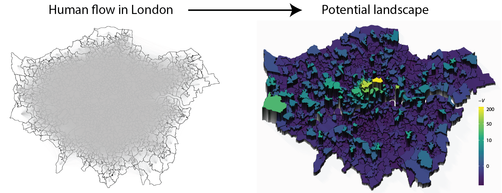

# HodgePotentialHumanFlow

This package provides Hodge-Kodaira decomposition tools for human flow.

See a [tutorial](articles/PotentialInTokyo.html) and references for details.

## Install
```
library(devtools)
install_github("TakaakiAokiWork/HodgePotentialHumanFlow")
```

## Abstract from our paper [[1]](#1)





Human flow in cities indicates social activity and can reveal urban spatial structures based on human behaviours for relevant applications. Scalar potential is a mathematical concept that, when properly applied, can provide an intuitive view of human flow. However, the definition of such a potential in terms of the origin-destination flow matrix and its feasibility remain unresolved. In this case, we use Hodge–Kodaira decomposition, which uniquely decomposes a matrix into a potential-driven (gradient) flow and a curl flow. We depict the potential landscapes in cities resulting from commuting flow and reveal how the landscapes have either changed or remained unchanged by years or methods of transportation. We then determine how well the commuting flow is described by the potential, by evaluating the percentage of the gradient component for metropolitan areas in the USA and show that the gradient component is almost 100% in several areas; in other areas, however, the curl component is dominant, indicating the importance of circular flow along with triangles of places. The potential landscape provides an easy-to-use visualisation tool for showing the attractive places of human flow and will help in a variety of applications such as commerce, urban design, and epidemic spreading.


## References
<a id="1">[1]</a> 
Urban spatial structures from human flow by Hodge-Kodaira decomposition,
Takaaki Aoki, Shota Fujishita & Naoya Fujiwara, 
Scientific Reports, vol. 12, 11258 (2022).
DOI: [10.1038/s41598-022-15512-z](https://doi.org/10.1038/s41598-022-15512-z)


<a id="2">[2]</a> 
City center identification as attractive places for people's collective movements, Takaaki Aoki, Shota Fujishima & Naoya Fujiwara, 
[arXiv:2211.14496](https://arxiv.org/abs/2211.14496) [physics.soc-ph]
